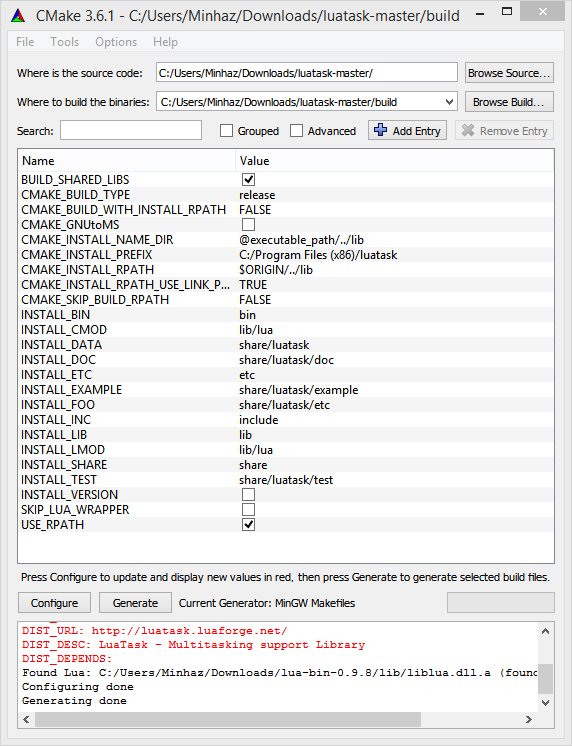
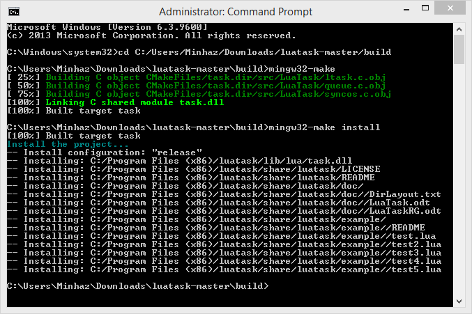

# LuaTask Binary for Windows

LuaTask DLL built on Windows 8.1 using mingw32-gcc-5.1.0 and cmake.

    Prebuilt binaries are inside bin directory of this repository

## Prerequisites

* Download [TDM MinGW32](http://tdm-gcc.tdragon.net/download)
* Download [Lua binary](http://luadist.org/)
* Download [CMake](https://cmake.org/download/)
* Download [LuaTask Source](https://github.com/LuaDist/luatask)

## How To Build

* Add MinGW32/bin location to PATH
* Add Lua/bin location to PATH
* Extract `luatask-master.zip` to some folder
* Open CMake-GUI and point to LuaTask source
* Create a build directory and set it from CMake
* Click `Configure`, then click `Generate`
    
    
    
* Go to the build directory, and run `mingw32-make`, then `mingw32-make install`
    
    
    
* Files will be available under `C:\Program Files (x86)\luatask`

## Test

* LuaTask library can be tested using the files at `share/luatask/example`
